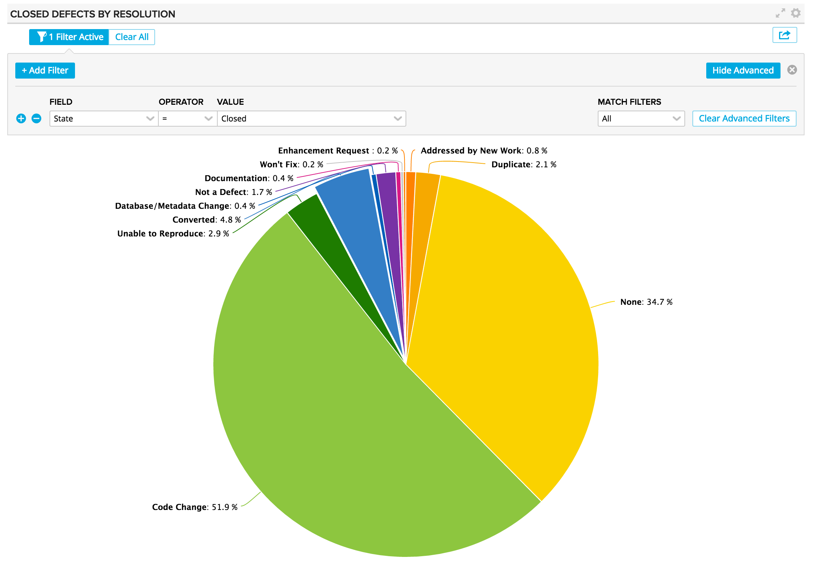
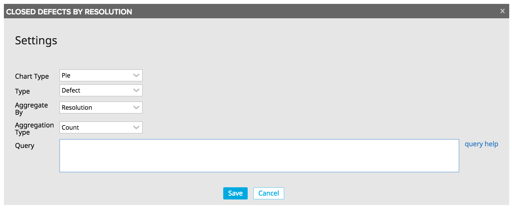

# Custom Chart

This app is the chart equivalent of the Custom Board and Custom List apps.  Pick a chart type (pie or bar), an artifact type, and a field to be aggregated and gain insight into your process via the generated chart.  Use the advanced filtering control to further slice and dice your data.  The data is also exportable for more fine grained inspection.

## Installation and Settings
The app is installed as a Custom HTML App ([see help documentation](https://help.rallydev.com/custom-html))
Once the app is installed, use the gear menu on the app panel and select "Edit App Settings". There are 5 settings you can configure.

#### Chart Type
Pick the type of chart you'd like to create.  Currently pie and bar are supported.

#### Type
Pick the type of data to include in the chart- Defect for example.

#### Aggregate By
Pick the attribute on the previously selected type which will be used for generating the summary data for the chart.

#### Aggregation Type
Pick how the summary should be performed- via a simple count or by summing the plan estimates.

#### Query
In addition to the advanced filtering component in the app, you can write your own complex filter queries. [Extensive documentation] (https://help.rallydev.com/grid-queries?basehost=https://rally1.rallydev.com) is available. This might be useful if you want to always limit the chart to certain complex criteria.
